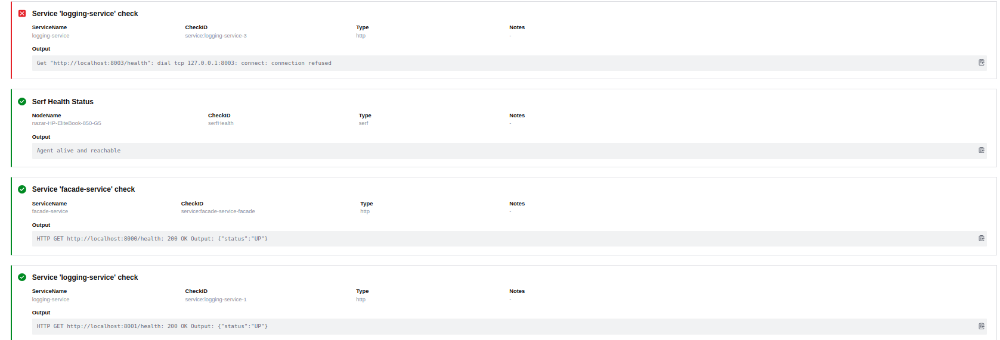
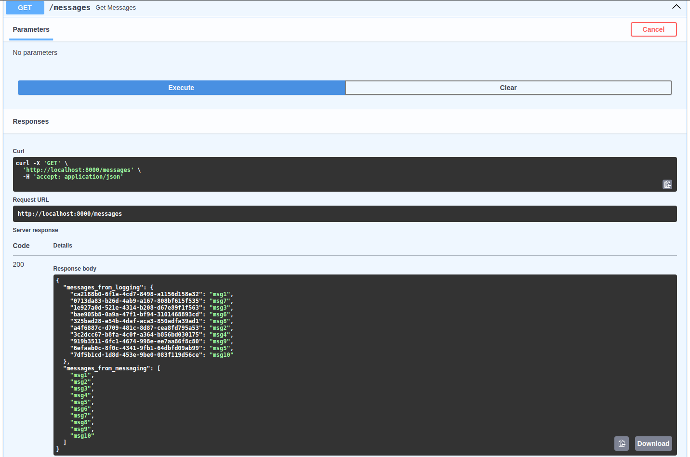
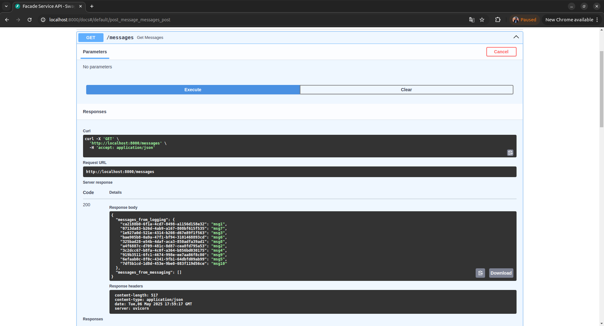
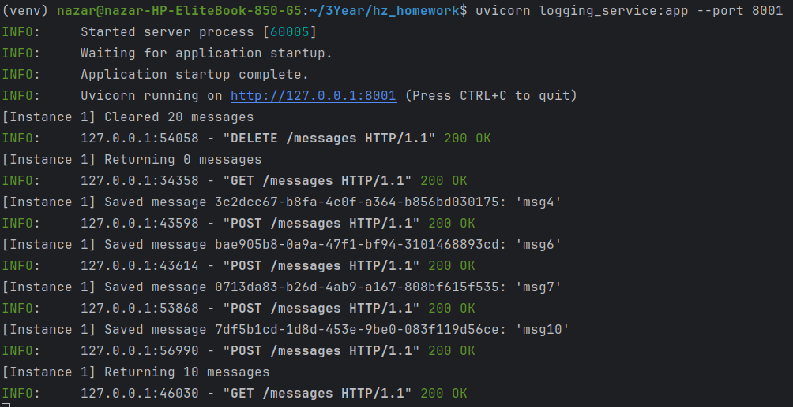
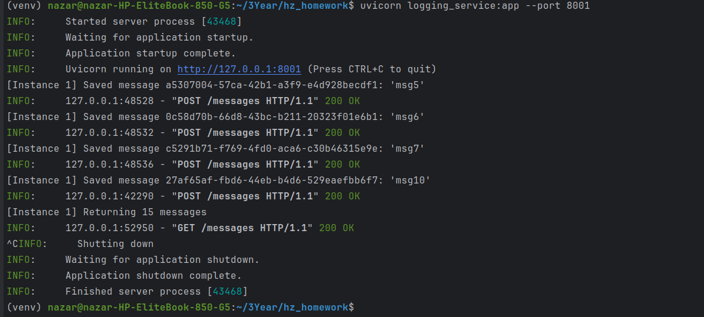
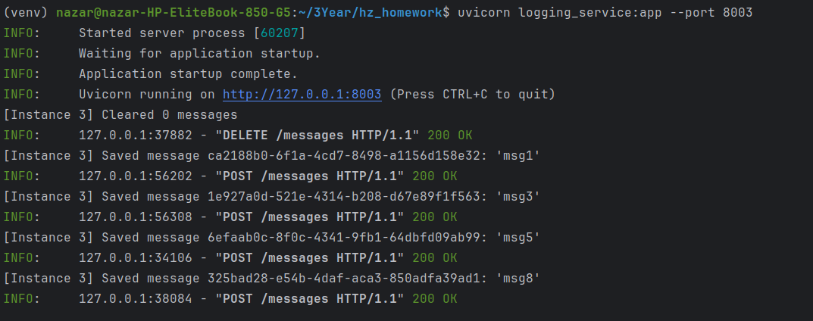
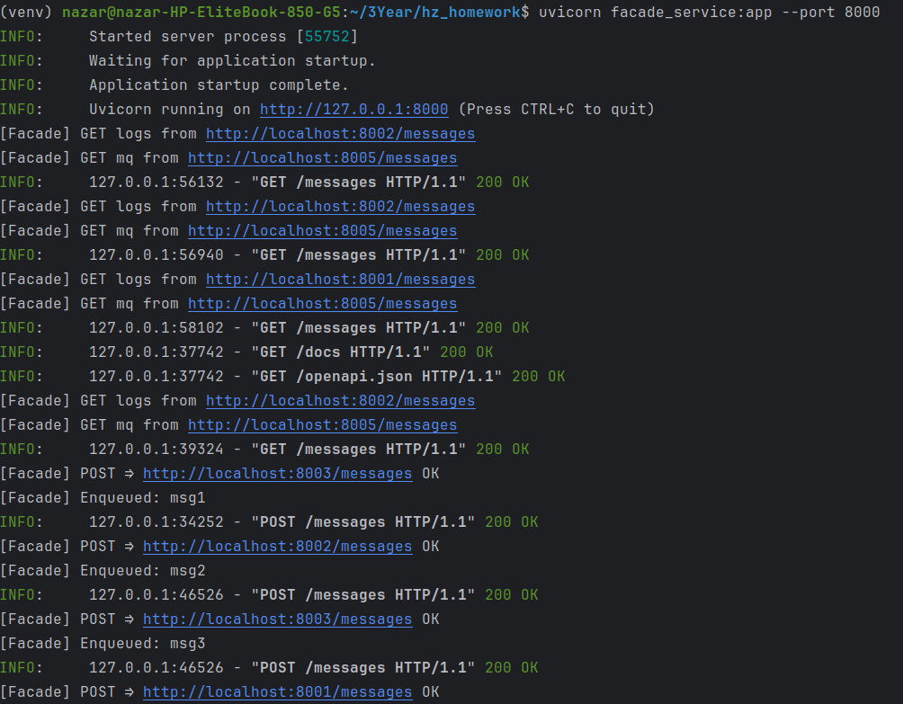
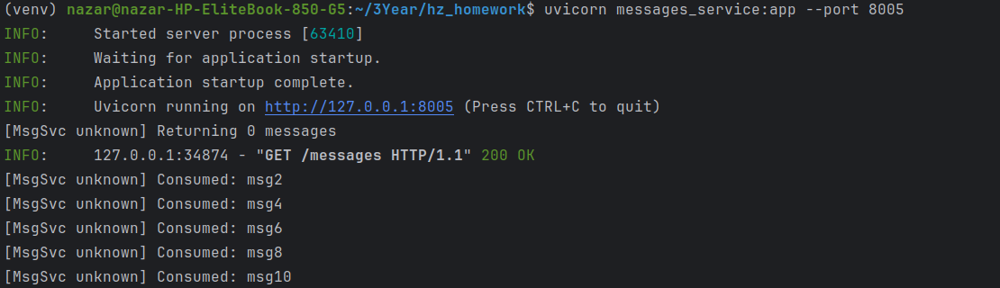
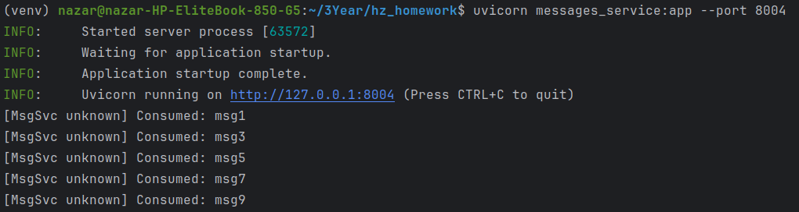

# Microservices Basics

### Usage

```commandline
python3 -m venv venv 
source env/bin/activate
pip install -r requirements.txt
```
run in different terminal

```commandline
export INSTANCE_ID=1 PORT=8001
uvicorn logging_service:app --port 8001

export INSTANCE_ID=2 PORT=8002
uvicorn logging_service:app --port 8002

export INSTANCE_ID=3 PORT=8003
uvicorn logging_service:app --port 8003


export INSTANCE_ID=1 PORT=8004
uvicorn messages_service:app --port 8004

export INSTANCE_ID=2 PORT=8005
uvicorn messages_service:app --port 8005


export PORT=8000 INSTANCE_ID=facade
uvicorn facade_service:app --port 8000
```

### Photos of logs and send requests

















