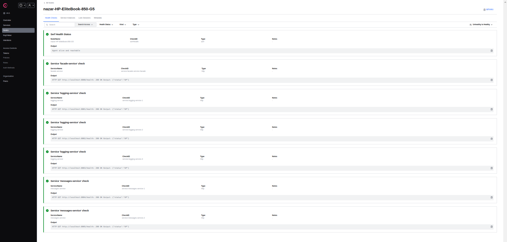

# Microservices Basics

### Usage

```commandline
python3 -m venv venv 
source env/bin/activate
pip install -r requirements.txt
```
run in different terminal

```commandline
uvicorn logging_service:app --port 8001
uvicorn logging_service:app --port 8002
uvicorn logging_service:app --port 8003

uvicorn messages_service:app --port 8004
uvicorn messages_service:app --port 8005

uvicorn facade_service:app --port 8000
```

### Photos of logs and send requests
